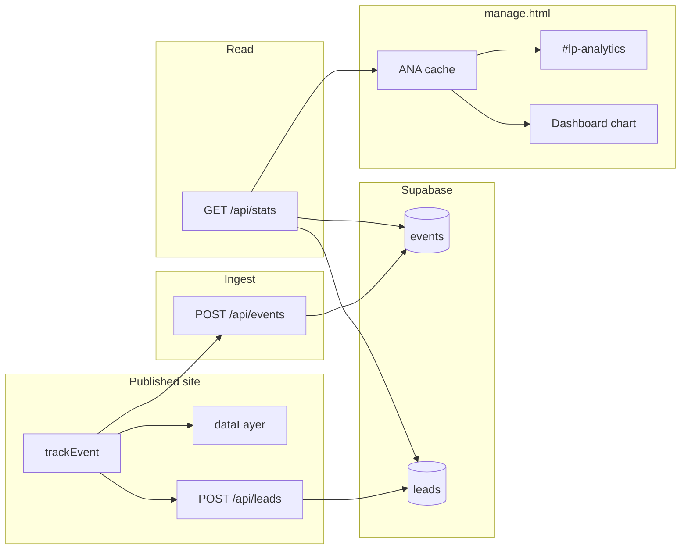
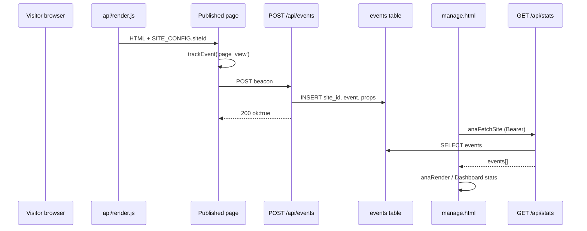
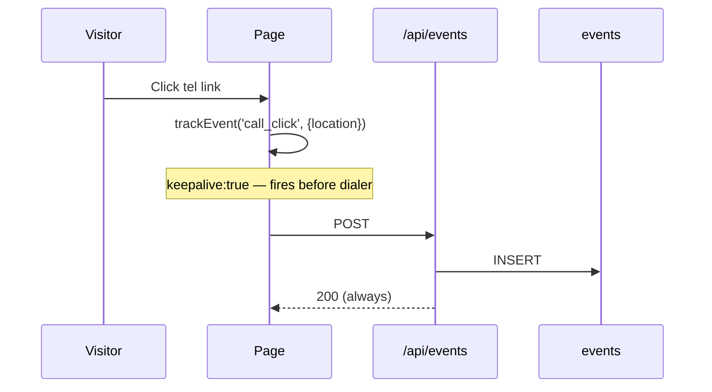
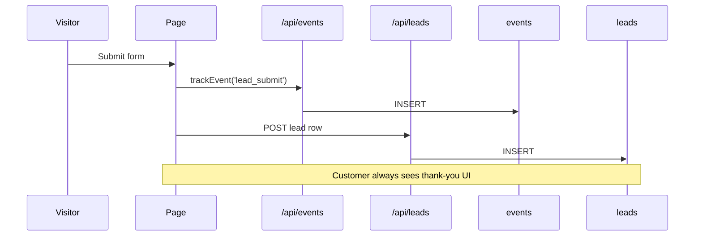
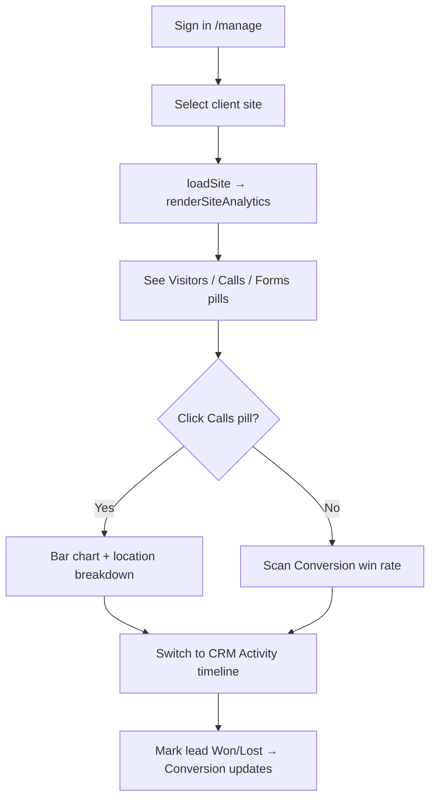
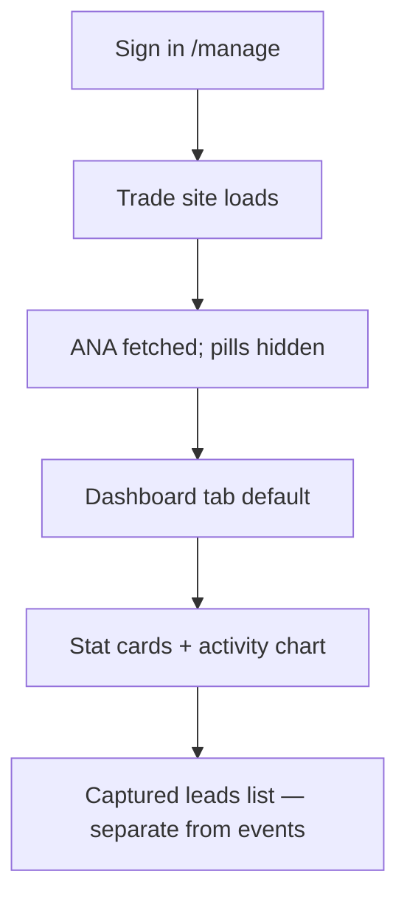
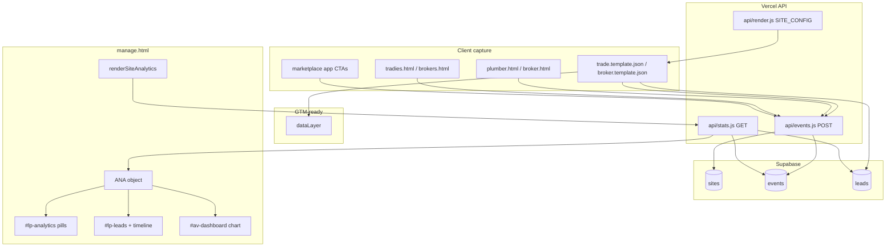
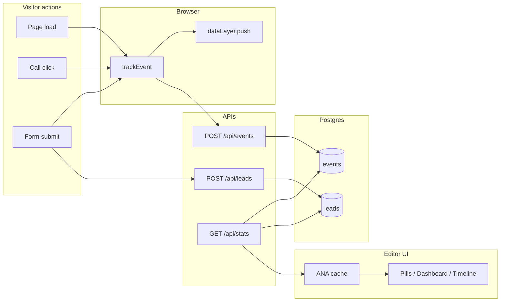
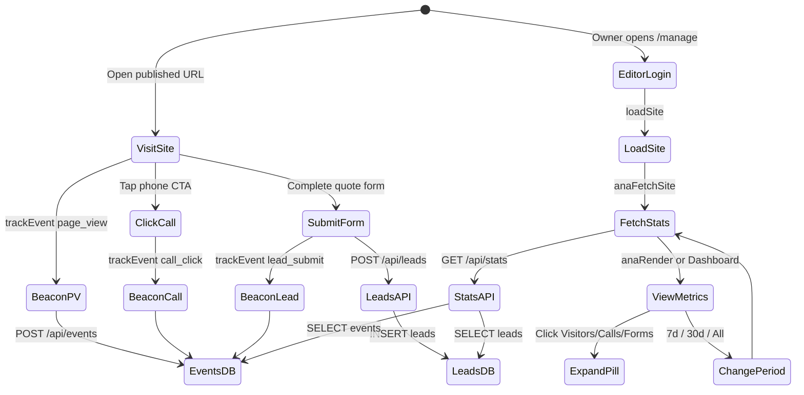

# LeadPages Tracking & Analytics — Complete Engineering Manual

**Document:** `features/Tracking`  
**Status:** Definitive engineering reference for visitor event capture, ingest APIs, and analytics display  
**Audience:** Engineers rebuilding, extending, or debugging tracking; AI development agents  
**Prerequisites:** [00-VISION](../00-VISION.md), [01-ARCHITECTURE](../01-ARCHITECTURE.md), [02-DATABASE](../02-DATABASE.md), [09-CRM](../09-CRM.md), [10-EDITOR](../10-EDITOR.md), [features/Dashboard](Dashboard.md)

> **Scope note:** This document describes the **end-to-end tracking pipeline** — public `trackEvent` beacons on tenant pages, `POST /api/events` ingest, the `events` Postgres table, `GET /api/stats` reads, and the **`ANA` analytics subsystem** in `manage.html`. It is **not** Google Analytics, Meta Pixel, or third-party tag managers (though `dataLayer` is reserved for future GTM-style integration). Canonical overview also lives in [07-TRACKING](../07-TRACKING.md); this manual adds implementation depth.

---

## Executive Summary

LeadPages tracks visitor behaviour with **lightweight client beacons** that POST JSON to a **public, always-200** ingest endpoint. Events land in the **`events` table** keyed by `site_id`. Authenticated editors read aggregated metrics through **`GET /api/stats`**, which populates the in-memory **`ANA` object** and drives either the **analytics pill strip** (`#lp-analytics`, broker templates) or the **trade Dashboard** stat cards and activity chart.

| Fact | Detail |
|------|--------|
| **Capture** | `trackEvent(name, props)` in tenant HTML templates |
| **Ingest** | `POST /api/events` — no auth, service-role INSERT, always HTTP 200 |
| **Storage** | Supabase `events` table (`site_id`, `event`, `props`, `created_at`) |
| **Read** | `GET /api/stats?siteId=&days=` — Bearer JWT, service-role SELECT |
| **Display** | `ANA` in `manage.html` → `#lp-analytics` or trade `#av-dashboard` |
| **Dual write** | Form submits fire `lead_submit` event **and** `POST /api/leads` row |
| **Principle** | Analytics must **never break the visitor experience** |

---

## Purpose

### Product purpose

Site owners and partners need proof that hosted sites generate activity: page visits, phone clicks, and form submissions. Tracking answers:

1. **Is anyone visiting?** — `page_view` counts.
2. **Are they calling?** — `call_click` with location breakdown (hero, mobile bar, footer, etc.).
3. **Are they enquiring?** — `lead_submit` events plus CRM rows in `leads`.
4. **How effective is the funnel?** — conversion metrics (win rate for brokers; lead/visitor ratio on trade Dashboard).

Without this pipeline, LeadPages would be a static site builder with no ROI visibility — undermining retention and partner sales narratives.

### Engineering purpose

- **Decouple capture from display** — public pages only know `/api/events`; editor never reads raw beacons from the browser.
- **Tenant isolation** — every stored row carries `site_id` (resolved at ingest when possible).
- **Fail-open ingest** — unknown events dropped silently; network errors swallowed on the client; server always returns `{"ok":true}`.
- **Single read path** — `/api/stats` centralises period filtering and joins lead status counts for conversion widgets.
- **GTM-ready mirror** — `window.dataLayer.push` on every `trackEvent` for future tag integration without template rewrites.

---

## Business Purpose

| Stakeholder | Value |
|-------------|-------|
| **Site owner (tradie / broker client)** | Visible proof of marketing ROI; nudges toward optimising CTAs |
| **Partner / broker** | Client self-service metrics; fewer support tickets about traffic |
| **LeadPages (platform)** | Retention — activity drives continued hosting; upsell to apps and mailer |
| **Super-admin** | Global all-sites table; portfolio-level visibility |

Call clicks are treated as the **money metric** — `keepalive: true` on beacon `fetch` so the event fires even as the mobile dialer opens.

---

## User Types

| User | Interacts with tracking how? |
|------|------------------------------|
| **Anonymous visitor** | Fires beacons via published site; no visibility into analytics |
| **Site owner** | Sees stats on trade Dashboard or (if broker template) analytics pills |
| **Broker / partner** | Same editor analytics; may manage multiple client sites |
| **Super-admin** | Per-site stats + **All sites** global overview (`ANA.active === 'global'`) |
| **Storefront visitor** | `tradies.html` / `brokers.html` use simplified `track()` — events stored with `site: 'Storefront'` text, often **no `site_id`** |

Visitors never authenticate to tracking endpoints. Editors must be signed in with a valid Supabase JWT to call `/api/stats`.

---

## Permissions

| Layer | Mechanism |
|-------|-----------|
| **`POST /api/events`** | **Public** — no auth; rate limiting is infrastructure-level (not app-enforced today) |
| **`GET /api/stats`** | Requires `Authorization: Bearer <supabase access token>`; 401 if missing/invalid |
| **Global stats** | Omitting `siteId` returns cross-site events — intended for super-admin UI only (no server-side role check beyond valid JWT) |
| **Direct Supabase fallback** | `anaFetchSite()` can query `events`/`leads` directly if API fails — depends on RLS permitting the signed-in user |
| **Billing lock** | `lpBillingGate()` blocks entire editor including analytics UI when account suspended |

Ingest uses **service role** to INSERT regardless of RLS on `events`. Reads in `/api/stats` also use service role so the dashboard works even if RLS on `events` is not configured for client SELECT.

---

## System Architecture

```text
┌─────────────────────────────────────────────────────────────────────────┐
│  PUBLISHED TENANT PAGE (trade / broker template via api/render.js)      │
│  SITE_CONFIG { business, slug, siteId, phone, … }                       │
│  trackEvent(name, props) → dataLayer.push + POST /api/events            │
└───────────────────────────────┬─────────────────────────────────────────┘
                                │
                                ▼
┌─────────────────────────────────────────────────────────────────────────┐
│  INGEST: api/events.js (duplicate: events.js at repo root)              │
│  ALLOWED whitelist · resolveSiteId · INSERT events · always 200         │
└───────────────────────────────┬─────────────────────────────────────────┘
                                │
                                ▼
┌─────────────────────────────────────────────────────────────────────────┐
│  STORAGE: Supabase events (+ leads for CRM, separate pipeline)          │
└───────────────────────────────┬─────────────────────────────────────────┘
                                │
                                ▼
┌─────────────────────────────────────────────────────────────────────────┐
│  READ: api/stats.js — GET ?siteId=&days= with Bearer JWT                │
└───────────────────────────────┬─────────────────────────────────────────┘
                                │
                                ▼
┌─────────────────────────────────────────────────────────────────────────┐
│  EDITOR: manage.html ANA object                                         │
│  broker-app / broker-leads → #lp-analytics pill strip                   │
│  trade → pills hidden; stats on Dashboard tab (#av-dashboard)           │
└─────────────────────────────────────────────────────────────────────────┘
```

---

## Event Catalog

### Allowed events (`ALLOWED` in `api/events.js`)

| Event | When fired | Typical `props` | Notes |
|-------|------------|-----------------|-------|
| **`page_view`** | Page load | `{ page, trade? }` | One per full page render |
| **`call_click`** | Tel / CTA click | `{ location: 'heroCall' \| 'mobile_bar' \| … }` | Primary conversion signal |
| **`lead_submit`** | Quote / lead form success path | `{ job, suburb }` or `{ goal }` | Also creates `leads` row via `/api/leads` |
| **`quote_open`** | Quote modal opened | — | Allowed but rarely wired |
| **`cta_click`** | Generic CTA | — | Allowed but rarely wired |

Events **not** in `ALLOWED` are **silently dropped** at ingest (HTTP 200, no INSERT). Example: broker calculator fires `calc_freq` in `broker.html` — **not stored**.

### Call-click location IDs (trade template)

Trade `wirePhones` / `applyCfg` hydrates many tel links. Common `props.location` values surfaced in analytics detail:

| Location ID | UI label (in `anaDetailHTML`) |
|-------------|-------------------------------|
| `heroCall` | Hero button |
| `headCall` | Header button |
| `navPhone` | Phone number |
| `formCall` | Form link |
| `emergCall` | Emergency bar |
| `footPhone` | Footer |
| `mobileCall` / `mobile_bar` | Mobile sticky bar |
| `heroSlider`, `proofStream`, `splitHero`, `promo`, `availability` | Marketplace app CTAs |

Unknown locations display as raw ID in breakdown chips.

---

## Visitor-Side Capture

### `trackEvent` contract

Embedded in `trade.template.json`, `broker.template.json`, and reference files `plumber.html` / `broker.html`. Production pages receive `SITE_CONFIG` from `api/render.js`:

```javascript
// api/render.js injects:
// Object.assign({ business, slug, siteId }, site.config)
const cfg = Object.assign(
  { business: site.business_name, slug: site.slug, siteId: site.id },
  site.config || {}
);
// tpl.replaceAll('__SITE_CONFIG__', safeJson(cfg));
```

Standard implementation:

```javascript
window.dataLayer = window.dataLayer || [];
function trackEvent(name, props = {}) {
  const payload = { event: name, site: SITE_CONFIG.business, ts: Date.now(), ...props };
  window.dataLayer.push(payload);
  fetch('/api/events', {
    method: 'POST',
    headers: { 'Content-Type': 'application/json' },
    body: JSON.stringify({
      site: SITE_CONFIG.business,
      siteId: SITE_CONFIG.siteId,   // present when rendered via api/render.js
      slug: SITE_CONFIG.slug,       // optional; not always in payload today
      event: name,
      props: { ...props, ts: Date.now() }
    }),
    keepalive: true
  }).catch(() => {});
}
```

Reference templates (`plumber.html`) often omit `siteId` in the POST body — ingest falls back to slug/business name lookup.

### Wiring patterns

**Page view** — end of template script:

```javascript
trackEvent('page_view', { page: 'trade_landing', trade: SITE_CONFIG.trade });
```

**Call clicks** — delegated per element ID:

```javascript
['emergCall','navPhone','headCall','heroCall','formCall','footPhone','mobileCall'].forEach(id => {
  const el = document.getElementById(id);
  if (!el) return;
  el.addEventListener('click', () => trackEvent('call_click', { location: id }));
});
```

**Lead submit** — before or alongside `/api/leads`:

```javascript
trackEvent('lead_submit', { job: data.job, suburb: data.suburb });
await fetch('/api/leads', { method: 'POST', /* … */ });
```

### Storefront pages

`tradies.html` and `brokers.html` use a minimal helper without `dataLayer`:

```javascript
function track(event, props) {
  try {
    fetch('/api/events', {
      method: 'POST',
      headers: { 'Content-Type': 'application/json' },
      body: JSON.stringify({ site: 'Storefront', event, props: props || {} })
    });
  } catch (e) {}
}
track('page_view', { page: 'home' });
```

These events typically have **`site_id: null`** because `'Storefront'` does not match a `business_name` lookup reliably.

---

## Ingest: `api/events.js`

Vercel serverless handler at `/api/events`. **Root `events.js` is a byte-for-byte duplicate** — keep both in sync when changing ingest logic.

| Behaviour | Detail |
|-----------|--------|
| **Methods** | POST only (others return 200 OK) |
| **Auth** | None |
| **DB client** | Supabase service role |
| **Response** | Always `200` + `{"ok":true}` |
| **Validation** | Event name must be in `ALLOWED` |
| **Error handling** | `console.error` server-side; client never sees failure |

### Request body shape

```javascript
{
  site: "<business name>",      // required for legacy resolution
  siteId?: "<uuid>",            // preferred — trusted if present
  slug?: "<slug>",              // fallback lookup
  event: "page_view" | …,
  props: { … }                  // JSONB; cloned via JSON.parse/stringify
}
```

### Site resolution order (`resolveSiteId`)

1. **`siteId`** from payload — trusted directly (set by `api/render.js`).
2. **`slug`** — `sites.slug` exact match.
3. **`site` (business name)** — case-insensitive `ilike` on `sites.business_name`, first row.

If all fail, row inserts with **`site_id: null`** but legacy **`site` text** preserved.

### Insert shape

```javascript
await admin.from('events').insert({
  site_id: site_id || null,
  event,           // cleaned, max 40 chars
  props,           // sanitised object
  site: clean(b.site, 160) || null   // legacy text column
});
```

### String cleaning

`clean(s, n)` trims and slices strings to prevent oversized payloads (`event` 40, `siteId` 64, `slug` 120, `site` 160).

---

## Read API: `api/stats.js`

`GET /api/stats?siteId={uuid}&days={n}`

| Query param | Effect |
|-------------|--------|
| **`siteId`** | Per-site mode — events + leads for one tenant |
| **`days`** | Rolling window; `0` or invalid → all time (`sinceIso` → 1970) |
| **(omit siteId)** | Global mode — events across all sites (max 20k rows) |

### Auth

```javascript
Authorization: Bearer <supabase access token>
```

`requireUser()` validates JWT via Supabase `auth.getUser`. Invalid/missing token → **401**.

### Per-site response

```javascript
{
  events: [{ event, created_at, props }],     // limit 10,000
  leads: [{ name, kind, created_at, status }], // limit 50, recent first
  leadsCount: number,                          // total in period
  statusCounts: { new, contacted, won, lost, total }
}
```

### Global response

```javascript
{ events: [{ event, site_id, created_at }] }  // limit 20,000
```

Uses service role for reads — does not depend on RLS on `events`.

---

## Analytics UI: `ANA` in `manage.html`

### State object

```javascript
var ANA = {
  period: 30,           // days: 7, 30, or 0 (all)
  active: null,         // expanded pill: 'page_view'|'call_click'|'lead_submit'|'conv'|'global'
  sort: 'visitors',    // global table sort key
  data: [],             // events[] for current site
  leads: [],            // recent leads from stats API
  leadsCount: 0,
  statusCounts: null,   // for conversion / win rate
  globalData: null      // cross-site events
};
```

### Metrics (`ANA_METRICS`)

| Key | Label | Source |
|-----|-------|--------|
| `page_view` | Visitors | Count in `ANA.data` |
| `call_click` | Calls | Count in `ANA.data` |
| `lead_submit` | Forms | `max(lead_submit events, leadsCount)` |
| `conv` | Conversion | Win rate: `won ÷ (won + lost)` from `statusCounts` |

Period toggles: **7d / 30d / All** — stored in `ANA.period`; changing period calls `anaRefresh()`.

### Key functions

| Function | Role |
|----------|------|
| `anaStats(params)` | `fetch('/api/stats?…')` with `cwToken()` Bearer |
| `anaFetchSite()` | Load current site into `ANA.data`, leads, statusCounts |
| `anaFetchGlobal()` | Load cross-site events for super-admin table |
| `anaCounts(rows)` | Aggregate `{ page_view, call_click, lead_submit }` |
| `anaDaily(rows, type, days)` | Bucket one event type per day for bar charts |
| `anaDetailHTML(k)` | Expanded pill content — funnels, call locations, recent leads |
| `anaGlobalHTML()` | Sortable all-sites table |
| `anaRender()` | Paint `#lp-analytics` pills + detail panel |
| `anaClick(e)` | Pill / period / global / sort interactions |
| `anaRefresh()` | Re-fetch after period change |
| `anaInit()` | Inject `#lp-analytics` above `.adminnav` if missing |
| `renderSiteAnalytics()` | Entry on `loadSite()` — init, billing gate, fetch, render |

### Analytics strip layout (`#lp-analytics`)

```text
┌──────────────────────────────────────────────────────────────────┐
│  [Visitors] [Calls] [Forms] [Conversion] [▦ All sites]  7d 30d All │
├──────────────────────────────────────────────────────────────────┤
│  (optional detail panel — bar chart, call breakdown, funnels)     │
└──────────────────────────────────────────────────────────────────┘
```

**Above/below the strip** (shared chrome, not part of ANA):

- `#lp-domains` — domain chips
- `#lp-leads` — CRM strip with **Activity** timeline toggle (`lpTimelineHTML` uses `ANA.data`)

### Template-specific display

| Template | Analytics UI |
|----------|----------------|
| **`broker-app`, `broker-leads`** | `#lp-analytics` visible — pill strip + detail |
| **`trade`** | `#lp-analytics` `display:none`; same `ANA.data` loaded; stats on **Dashboard** tab |

Trade Dashboard (`renderDashboard` → `_dashLoadStats`, `_dashDrawChart`) consumes **`ANA`** but uses different conversion math (lead/visitor %, not win rate). See [features/Dashboard](Dashboard.md).

### Activity timeline

`lpTimelineHTML()` builds a feed from `ANA.data` — last 30 events, labels:

- `page_view` → "Visited the page"
- `call_click` → "Clicked to call"
- `lead_submit` → "Submitted the quote form"

Available on broker CRM strip (**Activity** button); not exposed on trade Dashboard today.

---

## Data Sources



| Source | Table / endpoint | Fields used |
|--------|------------------|-------------|
| Beacons | `POST /api/events` | `event`, `props`, `site_id` |
| Stats API | `GET /api/stats` | `events[]`, `leadsCount`, `statusCounts` |
| Fallback | Direct Supabase `events`, `leads` | When `/api/stats` returns null |
| CRM | `leads` | Form count reconciliation; conversion status |
| Global | `GET /api/stats` (no siteId) | Cross-site aggregation |

---

## API Calls

| Endpoint | Method | Called by | Query / body | Response used |
|----------|--------|-----------|--------------|-----------------|
| `/api/events` | POST | `trackEvent`, storefront `track()` | `{ site, siteId?, event, props }` | Ignored (`ok: true`) |
| `/api/stats` | GET | `anaStats()` → `anaFetchSite`, `anaFetchGlobal` | `siteId`, `days` | Full `ANA` populate |
| `/api/leads` | POST | Form submit handlers | Lead payload | CRM row (parallel to `lead_submit` event) |
| Supabase `events` | SELECT | `anaFetchSite` fallback | `.eq('site_id')`, date filter | `ANA.data` |
| Supabase `leads` | SELECT | `anaFetchSite` fallback | status aggregation | `ANA.statusCounts` |

Auth: only `/api/stats` requires Bearer token (`cwToken()` from Supabase session).

---

## Database Tables

### `events`

| Column | Purpose |
|--------|---------|
| `id` | Primary key |
| `site_id` | FK → `sites.id` (nullable if resolution fails) |
| `event` | Event name (`page_view`, `call_click`, …) |
| `props` | JSONB metadata (`location`, `page`, `job`, `ts`, …) |
| `created_at` | Timestamp (default now) |
| `site` | Legacy business name text |

**Indexes (recommended):** `(site_id, created_at)` for dashboard queries.

### Related tables

| Table | Tracking relationship |
|-------|----------------------|
| **`sites`** | Resolution target for ingest; `business_name`, `slug`, `id` |
| **`leads`** | Dual-written on form submit; feeds Forms count and Conversion win rate |

`config` JSONB on `sites` does **not** store analytics — all metrics come from `events` + `leads`.

---

## Related Files

| File | Relationship |
|------|--------------|
| **`api/events.js`** | **Primary ingest** — public POST handler |
| **`events.js`** | Root duplicate of `api/events.js` |
| **`api/stats.js`** | Authenticated read API |
| **`stats.js`** | Root duplicate of `api/stats.js` |
| **`api/render.js`** | Injects `SITE_CONFIG` with `siteId` into templates |
| **`trade.template.json`** | Production trade tracking + phone wiring |
| **`broker.template.json`** | Production broker tracking |
| **`plumber.html` / `broker.html`** | Human-readable reference implementations |
| **`manage.html`** | **Primary display** — `ANA`, `#lp-analytics`, Dashboard chart |
| **`tradies.html` / `brokers.html`** | Storefront beacons (no `site_id`) |
| **`marketplace/demos/demo-shared.js`** | App CTAs fire `call_click` with app-specific locations |
| **`docs/07-TRACKING.md`** | Canon overview (shorter) |
| **`docs/features/Dashboard.md`** | Trade Dashboard consumption of `ANA` |
| **`docs/09-CRM.md`** | Lead lifecycle parallel to `lead_submit` |

---

## Functions

### Ingest (`api/events.js`)

| Function | Role |
|----------|------|
| `readBody(req)` | Parse JSON from Vercel body or stream |
| `clean(s, n)` | Trim and max-length sanitise strings |
| `resolveSiteId({ siteId, slug, site })` | Map payload → `sites.id` |
| `module.exports` | POST handler — validate, insert, always 200 |

### Read (`api/stats.js`)

| Function | Role |
|----------|------|
| `requireUser(req)` | Validate Bearer JWT |
| `sinceIso(days)` | Rolling window cutoff |
| `module.exports` | GET handler — per-site or global |

### Editor (`manage.html`, approx. lines 3259–3564)

| Function | Role |
|----------|------|
| `anaStats(params)` | HTTP client for `/api/stats` |
| `anaFetchSite()` | Populate `ANA` for `currentSiteId` |
| `anaFetchGlobal()` | Populate `ANA.globalData` |
| `anaCounts(rows)` | Event tallies by type |
| `anaDaily(rows, type, days)` | Daily buckets for bar charts |
| `anaBars(series, color)` | HTML bar chart markup |
| `anaFunnel(label, n, pct)` | Funnel stat card HTML |
| `anaDetailHTML(k)` | Expanded metric panel |
| `anaGlobalRows()` | Aggregate global events by site |
| `anaGlobalHTML()` | All-sites table HTML |
| `anaRender()` | Paint pill strip |
| `anaClick(e)` | UI event delegation |
| `anaRefresh()` | Re-fetch after period change |
| `anaInit()` | Create `#lp-analytics` DOM |
| `renderSiteAnalytics()` | Called from `loadSite()` |
| `lpTimelineHTML()` | CRM activity feed from `ANA.data` |

### Trade Dashboard (uses `ANA`, see Dashboard.md)

| Function | Role |
|----------|------|
| `_dashLoadStats()` | Stat cards from `ANA` |
| `_dashDrawChart()` | SVG time-series from `ANA.data` |

---

## Event Flow

### Page visit



### Call click



### Form submit (dual write)



### Period change in editor

1. User clicks **7d / 30d / All** on `#lp-analytics`.
2. `ANA.period` updated; `anaRefresh()` called.
3. `anaFetchSite()` (and `anaFetchGlobal()` if open) re-query `/api/stats`.
4. `anaRender()` repaints pills and detail panel.

---

## User Journey

### Site owner checking weekly stats (broker template)



### Tradie on trade template



See [features/Dashboard](Dashboard.md) for full trade Dashboard journey.

---

## Performance Considerations

| Area | Behaviour | Risk |
|------|-----------|------|
| **Ingest** | Single INSERT per beacon; no batching | High-traffic sites = many rows; no archival yet |
| **Stats API cap** | 10k events / site; 20k global | Older events omitted in long "All" periods |
| **Client beacons** | Fire-and-forget; no retry | Lost events on network blip (acceptable trade-off) |
| **`ANA.data` in memory** | Full event array loaded client-side | Chart bucketing OK for ≤10k; memory grows with period |
| **Global view** | Aggregates up to 20k events client-side | Slow for super-admin with many sites |
| **Duplicate fetch** | Dashboard + CRM may re-query leads | Extra bandwidth (see Dashboard debt) |
| **Direct fallback** | Double query path if API fails | Rare; adds Supabase load |

**Recommendations (future):** Server-side aggregation endpoint; partition/archive events &gt; 12 months; send `siteId` in all template beacons.

---

## Security Considerations

| Topic | Detail |
|-------|--------|
| **Public ingest** | Anyone can POST to `/api/events` — spam/fake events possible; mitigated by ALLOWED whitelist and no sensitive data in response |
| **No PII in events** | Beacons should not include name/phone — those go to `/api/leads` |
| **Stats auth** | JWT required; service role read bypasses RLS — trust that only authenticated editors call API |
| **Global stats** | No explicit super-admin check in `api/stats.js` — any valid user token can omit `siteId` |
| **XSS in analytics UI** | `anaEsc()` used in detail HTML; event props displayed escaped |
| **Service role key** | Server-only — never exposed to browser |
| **Tenant isolation** | Depends on correct `site_id` resolution — misconfigured templates may write `site_id: null` |

Tracking is intentionally **low-friction over high-integrity** — suitable for marketing metrics, not audited financial reporting.

---

## Technical Debt

| ID | Issue | Location | Impact |
|----|-------|----------|--------|
| TD-T1 | **Dashboard Calls uses `phone_click`** | `_dashLoadStats` ~5346 | Calls stat card shows 0; events use `call_click` |
| TD-T2 | **`siteId` not always in beacon body** | Reference templates | Falls back to name lookup; orphan rows possible |
| TD-T3 | **`calc_freq` dropped** | `broker.html` calculator | Calculator usage not tracked |
| TD-T4 | **Storefront events lack `site_id`** | `tradies.html`, `brokers.html` | Pollutes global queries; not attributed to tenants |
| TD-T5 | **No rate limiting on ingest** | `api/events.js` | Vulnerable to event spam |
| TD-T6 | **Global stats without role gate** | `api/stats.js` | Any authenticated user could fetch all-site events |
| TD-T7 | **Duplicate root files** | `events.js`, `stats.js` | Drift risk vs `api/` copies |
| TD-T8 | **Conversion definition split** | ANA vs Dashboard | Win rate vs lead/visitor % confuses power users |
| TD-T9 | **Dashboard chart period decoupled** | `_dashChartPeriod` vs `ANA.period` | Trade chart may disagree with pill period |
| TD-T10 | **`quote_open` / `cta_click` unused** | ALLOWED but unwired | Dead event types in schema |

Tracked in [13-ROADMAP](../13-ROADMAP.md) as NT-9 (`phone_click` fix).

---

## Future Improvements

1. **Fix Calls metric on trade Dashboard** — use `c.call_click` in `_dashLoadStats`.
2. **Always send `siteId` + `slug`** in every `trackEvent` POST body.
3. **Rate limit `/api/events`** — per IP or per `site_id` token.
4. **Super-admin gate** on global stats mode in `api/stats.js`.
5. **UTM capture** — store campaign params in `props` on `page_view`.
6. **Wire `quote_open` / `cta_click`** or remove from ALLOWED.
7. **Allow `calc_freq`** or dedicated calculator events for broker templates.
8. **Server-side daily rollups** — materialised view for fast dashboards.
9. **Event archival** — move rows &gt; 12 months to cold storage.
10. **GTM export** — consume `dataLayer` in managed tag container.
11. **Align chart periods** — single `ANA.period` for pills and Dashboard chart.
12. **Delete or sync root duplicates** — single source in `api/`.

---

## Tracking Architecture



---

## Connections to Other Systems

### Editor

Tracking display lives entirely inside `manage.html`. `loadSite()` always calls `renderSiteAnalytics()` which:

1. Runs `lpBillingGate()` (may block UI).
2. Hides `#lp-analytics` for trade template.
3. Fetches `ANA` via `/api/stats`.
4. Initializes `#lp-domains` and `#lp-leads` chrome around the analytics strip.

See [10-EDITOR](../10-EDITOR.md).

### CRM

Form submits **dual-write**: `lead_submit` event + `/api/leads` INSERT. CRM strip (`LPLEADS`) and analytics share lead counts; status changes (Won/Lost) update `ANA.statusCounts` and Conversion pill.

See [09-CRM](../09-CRM.md).

### Dashboard (trade)

Trade sites hide analytics pills but **reuse the same `ANA.data`**. Dashboard stat cards and SVG chart read from `anaCounts(ANA.data)` after `anaFetchSite()`.

See [features/Dashboard](Dashboard.md).

### Publishing / render

Published pages are rendered by `api/render.js`, which injects `siteId` into `SITE_CONFIG`. Tracking only works on **published** tenant routes — editor preview may differ if preview HTML omits beacons.

See [03-TEMPLATE-SYSTEM](../03-TEMPLATE-SYSTEM.md).

### Partners

Partners viewing client sites in `/manage` see the same analytics as clients. `partner-dashboard.html` shows aggregate portfolio metrics separately — not the `ANA` subsystem documented here.

See [05-PARTNERS](../05-PARTNERS.md).

### Billing

`lpBillingGate()` inside `renderSiteAnalytics()` prevents locked accounts from viewing stats. Public ingest continues regardless of billing state.

---

## Data Flow



---

## User Flow



---

## Glossary

| Term | Meaning |
|------|---------|
| **Beacon** | Fire-and-forget `POST /api/events` from visitor browser |
| **ANA** | In-memory analytics object in `manage.html` |
| **`trackEvent`** | Standard client function on tenant pages |
| **`ALLOWED`** | Server-side whitelist of storable event names |
| **`dataLayer`** | GTM-style queue mirrored on every track |
| **`call_click`** | Phone/CTA click event — primary call tracking |
| **Dual write** | Form path writes both `events` and `leads` |
| **Win rate** | Conversion on broker pills: `won ÷ (won + lost)` |

---

*Last updated: July 2026 — reflects `api/events.js`, `api/stats.js`, and `manage.html` ANA implementation on branch `main`.*
