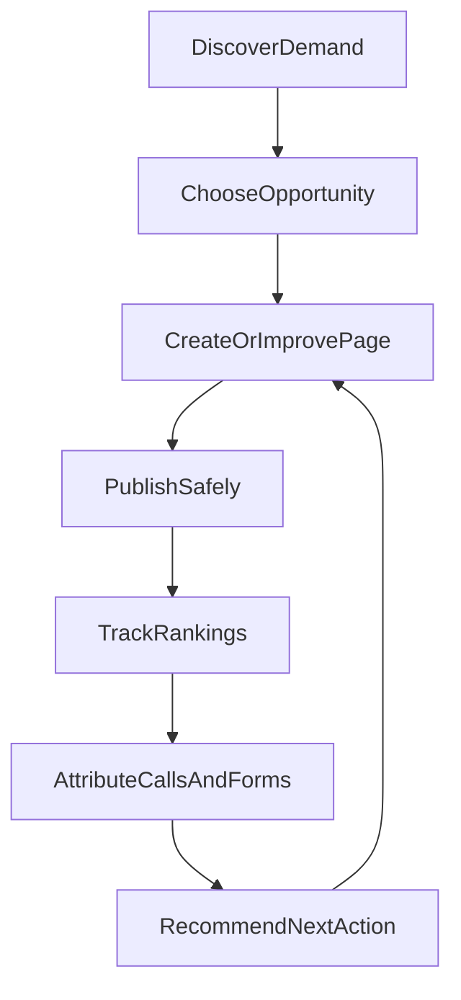

# Leadpages Search Intelligence — Vision

**Document:** `search-intelligence/00-VISION`  
**Status:** Product position for Search Intelligence / SEO Command Centre  
**Audience:** Product, engineering, partners, AI agents  
**Prerequisites:** [../00-VISION.md](../00-VISION.md), [../08-SEO.md](../08-SEO.md)

---

## Working names

| Name | Role |
|------|------|
| **Leadpages Search Intelligence** | Broader product (research, execution, attribution) |
| **SEO Command Centre** | Client-facing workspace inside App Command Centre |

---

## Strategic position

Do **not** clone every Semrush report. Semrush is a horizontal marketing-data platform. Recreating its global keyword, SERP, traffic and backlink databases would be a separate data-company undertaking.

Leadpages owns the point where a recommendation becomes a **live website, landing page, call, form submission and customer**.

> **Find the best local search opportunity, build the right page, publish the fix, and prove which keyword produced the lead.**

---

## Locked decisions

| Decision | Choice |
|----------|--------|
| Primary market | Local / service-area businesses; partners as operators |
| External sites | Not in Phases 0–2; Phase 3+ partner tooling |
| First Google connectors | Search Console + GA4; Ads in progress; GBP Phase 3 |
| Market data | Provider gateway; first adapter **DataForSEO**; Semrush API alternate |
| Call attribution v1 | Call-clicks + `visitor_sessions` (no provisioned numbers yet) |
| Autopilot default | Recommend / prepare draft only — **no silent publish** |
| Launch scope | Leadpages-hosted trade/landing sites only |

---

## What must eventually be covered

Keyword research/clustering, domain & competitor research, rank tracking, site audit, on-page optimisation, content briefs/gaps, backlinks (licensed), local SEO (GBP/Maps), AI visibility, reporting, partner portfolio.

## What not to copy initially

- Global traffic-estimation panels comparable to large clickstream datasets
- Self-built web-scale backlink crawler
- General-purpose social scheduling
- Broad enterprise market research / PR outreach databases
- Isolated AI article writers with no connection to the website

License commodity data. Own workflow, scoring, publish and lead outcomes.

---

## Proprietary advantages

1. **Search-to-lead attribution** — GSC + ranks + forms/call-clicks + (later) CRM value  
2. **SEO Autopilot with approval** — drafts and safe technical fixes only  
3. **Local Opportunity Map** — demand × visibility × leads by geography  
4. **Search Digital Twin** — per-site search intelligence on Site Brain  
5. **Outcome-based scoring** — leads and value over vanity activity  

---

## Relationship to publish SEO

Existing tenant SEO (titles, meta, suburbs, sitemaps, GSC **verification**) remains documented in [../08-SEO.md](../08-SEO.md) and [../features/SEO.md](../features/SEO.md). Search Intelligence **consumes** that stack; it does not replace the renderer.
