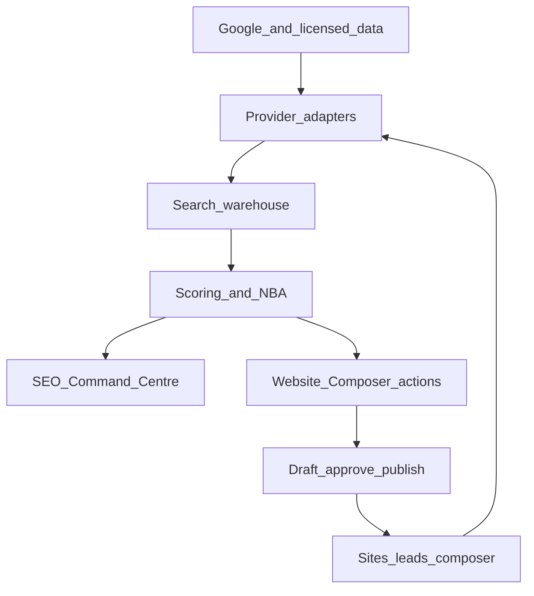

# Search Intelligence — Architecture

**Document:** `search-intelligence/01-ARCHITECTURE`  
**Status:** System architecture  
**Prerequisites:** [00-VISION.md](00-VISION.md), [../01-ARCHITECTURE.md](../01-ARCHITECTURE.md)

---

## High-level flow



---

## Core services

| # | Service | Responsibility |
|---|---------|----------------|
| 1 | **Connector service** | OAuth, token encryption, property/location mapping, sync health |
| 2 | **Provider gateway** | Normalise keyword/SERP/rank/backlink/AI data; cache; budgets; failover |
| 3 | **Crawler & renderer audit** | Scheduled crawl + first-party `sites.config` / template inspection |
| 4 | **Search warehouse** | Time-series keywords, ranks, pages, queries, issues, leads, changes |
| 5 | **Entity/keyword graph** | Business → service → location → intent → keyword → page → lead |
| 6 | **Recommendation engine** | Deterministic technical rules + scored opportunities; AI explains/drafts only |
| 7 | **Job scheduler** | Priority/plan/cost-aware refreshes |
| 8 | **Reporting service** | Dashboards, snapshots, scheduled reports, partner rollups |
| 9 | **Composer action layer** | Approved recommendations → structured page/app/config changes |
| 10 | **Audit & consent** | Data access, evidence, approvals, changes, rollbacks |

---

## Reuse contracts (do not fork)

| Capability | Existing home |
|------------|---------------|
| Titles / meta / canonical | `lib/seo/meta.js`, `api/render.js` |
| Sitemaps | `lib/seo/sitemap.js`, `api/seo-sitemap.xml.js`, `api/site/sitemap.js` |
| GSC verification (not API) | `api/site/google-verification.js`, Settings → Search & indexing |
| Landing SEO drafts | `api/brain/landing-draft.js`, `lib/brain/landing-brief.js` |
| Site knowledge | `lib/site-brain/*` — extend with `searchIntelligence` |
| OAuth / encryption pattern | `api/integrations/google-ads/*`, `db/google_ads_schema.sql` |
| Lead events | Forms, call-clicks, `visitor_sessions` |

---

## Module layout (scaffold)

```
lib/search-intelligence/
  providers/     types, gateway, dataforseo, mock
  scoring/       opportunity-value
  recipes/       registry (first 10 NBA recipes)
db/search_intelligence_schema.sql   # draft migration (Phase 1 applies subset)
```

API paths (future, reserved):

- `/api/integrations/search-console/*`
- `/api/integrations/google-analytics/*`
- `/api/search-intelligence/*` (site-scoped Command Centre APIs)

UI (future):

- Manage tab **SEO Command Centre**
- Settings → Search & indexing remains verification + sitemap only
- Partner portfolio rollup in partner console

---

## Tenancy & security

- Strict site/partner isolation on every `si_*` table (`site_id`)
- Encrypted OAuth tokens (`enc:v1:` AES-256-GCM), least-privilege scopes
- Australian Privacy Principles / GDPR-aware retention and deletion
- Provider licensing compliance; budget caps per tenant
- Idempotent jobs; retries / dead-letter
- Source timestamp + freshness on every metric
- Clear labels: **measured** / **estimated** / **modelled**
- No hidden AI publication; rollbackable page changes
- WCAG 2.2 AA target for Command Centre UI

---

## Website action layer

Phase 1–2 recommendations resolve only through existing capabilities:

1. Open editor / SEO title–meta fields  
2. Brain landing draft (`landing-draft` / Forge `create_landing_page`)  
3. Sitemap regen via `api/site/sitemap.js`  
4. Preview + human approve  

**Scout** remains recommend-only until **Forge** executes approved plans (see [09-SEARCH-DIGITAL-TWIN.md](09-SEARCH-DIGITAL-TWIN.md)).
