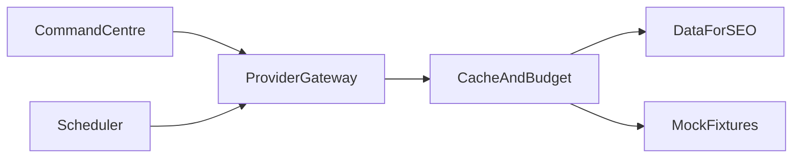

# Search Intelligence — Provider Gateway

**Document:** `search-intelligence/04-PROVIDER-GATEWAY`  
**Status:** Normalised market-data contract  
**Code:** [`../../lib/search-intelligence/providers/`](../../lib/search-intelligence/providers/)  
**Bake-off:** [PHASE-0-BAKEOFF.md](PHASE-0-BAKEOFF.md)

---

## Principle

Do **not** couple product code to one vendor response schema. All keyword, SERP, rank, competitor and backlink calls go through the gateway.

---

## Adapters

| Provider | Role |
|----------|------|
| **DataForSEO** | Sole live market-data provider (AU local SERP / Labs) |
| Mock | Tests and docs examples |

**Semrush is out of scope permanently** — no license, no adapter, no failover path. Product code must not reference Semrush APIs.

---

## Normalised DTOs (`lib/search-intelligence/providers/types.js`)

| Type | Fields (summary) |
|------|------------------|
| `KeywordIdea` | keyword, location, language, volume, cpc, competition, difficulty, intent, localIntent, trend |
| `SerpSnapshot` | keyword, location, device, fetchedAt, features[], results[] |
| `SerpResult` | rank, url, domain, title, snippet, type (organic/maps/…) |
| `RankObservation` | keywordId, url, position, device, geo, fetchedAt, features |
| `CompetitorDomain` | domain, visibilityEstimate, overlapCount |
| `BacklinkSummary` | referringDomains, newLost, topAnchors (Phase 4 via DataForSEO) |

Every response includes `provider`, `fetchedAt`, `labelClass` (`measured` \| `estimated` \| `modelled`).

---

## Gateway responsibilities

1. Route operation → adapter  
2. Enforce tenant **budget** (`si_provider_usage`)  
3. Cache shared market data where licensing permits  
4. Plan-based refresh frequency (not unlimited user triggers)  
5. Fail soft with structured errors (`not_configured`, `budget_exceeded`, `provider_error`)  

---

## Operations

| Op | Description |
|----|-------------|
| `keywordIdeas` | Seed → related keywords + volume/CPC |
| `serp` | Live SERP for keyword × geo × device |
| `mapsGrid` | Google Maps SERP at lat/lng (Maps-grid cells) |
| `domainOverview` | Light competitor/domain snapshot |
| `rankCheck` | Position for tracked keywords |
| `backlinkSummary` | Referring domains / backlinks (DataForSEO Backlinks API) |

AI visibility probes reuse `serp` features (`ai_overview`) and extract nested citation refs when DataForSEO returns them. Platform catalogue: Google AI Overviews (live), ChatGPT SERP block (aliased), ChatGPT Answers / Perplexity (`unavailable` — not scraped). Semrush is never used.

---

## Live vs stub behaviour

- `dataforseo.js` returns `{ ok: false, error: 'not_configured' }` until `DATAFORSEO_LOGIN` + `DATAFORSEO_PASSWORD` are set (aliases: `DATAFORSEO_EMAIL` / `DATAFORSEO_API_PASSWORD`, `DFS_LOGIN` / `DFS_PASSWORD`)
- When credentials exist and `SI_PROVIDER` / `SI_KEYWORD_PROVIDER` are unset, the gateway **auto-prefers** DataForSEO
- Explicit `SI_PROVIDER=mock` always wins; any `semrush` preference is remapped to DataForSEO/mock
- Live ops: `keywordIdeas` → Labs `google/keyword_ideas/live`; `serp` / `rankCheck` → `serp/google/organic/live/advanced`; `mapsGrid` → `serp/google/maps/live/advanced`; `domainOverview` → Labs `google/domain_rank_overview/live`; `backlinkSummary` → `backlinks/summary/live`
- Default geo: `DATAFORSEO_LOCATION_CODE` (default **2036** Australia)
- `mock.js` returns deterministic fixtures for unit tests  

---

## Cost controls

Meter: keyword ideas, SERP locations, grid points, competitor domains, backlink rows, AI prompts.  
Cache TTLs and plan caps documented in [08-ROADMAP.md](08-ROADMAP.md).
